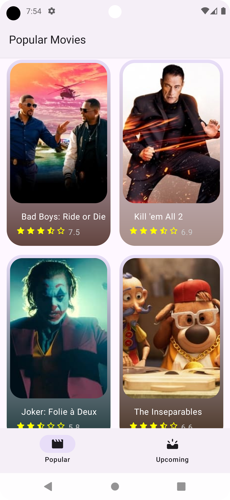
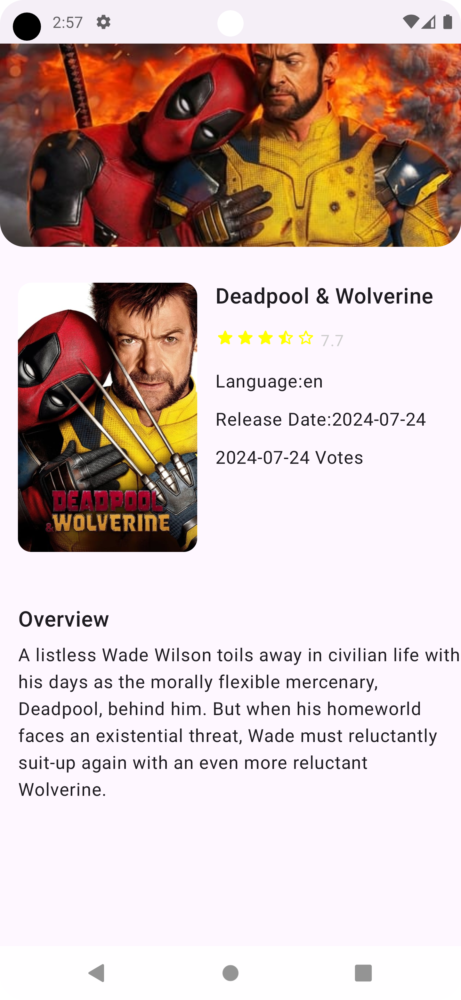
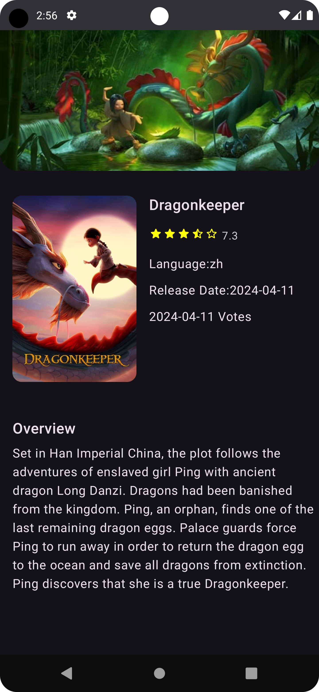

## Trending Movies 🎬
Trending Movies is an Android app that fetches popular and upcoming movies from [The Movie Database (TMDb)](https://developer.themoviedb.org/docs/getting-started) 
API and displays them in a list. The app is fully built using Jetpack Compose and follows the MVVM architecture pattern. 
It also supports offline mode by caching data locally.

## Features 🚀
- Popular and Upcoming Movies: Browse through popular and upcoming movies.
- Movie Details: View detailed information about a selected movie.
- Offline Mode: When the device has no internet connection, data is loaded from the Room database.
- MVVM Architecture: The app follows the Model-View-ViewModel (MVVM) architecture for better code organization and testability.
- Dependency Injection: Hilt is used for dependency injection.
- API Management: Data is fetched using Retrofit and OkHttp3.
- Local Database: Movies are cached in a local Room database for offline use.
- Image Loading: Movie posters are loaded using Coil.
- Navigation: Jetpack Compose Navigation is used for navigating between screens.
- Material Design: UI components are built using Compose Material Icons.

## Screenshots 📱
Below are some screenshots of the app:
<p align="center">
  
  
  
  
</p>

## Technologies and Libraries Used 🛠
- Jetpack Compose: For building the UI components.
- MVVM: For a clean and maintainable architecture.
- Room: For local database management and offline support.
- Retrofit: For making API requests.
- Hilt: For managing dependency injection.
- OkHttp3: Used with Retrofit for networking.
- Coil: For loading movie posters and other images.
- Compose Navigation: For navigating between different screens.
- Compose Material Icons: For using Material Design icons in the UI.

## Architecture Details 🛠️
- ViewModel: Handles the UI state using StateFlow and manages events with Channel.
- Repository: Manages data fetching from the API or local Room database.
- Dependency Injection: Managed using Hilt, which simplifies testing and dependency management.

## Setup and Run
1- Clone the repository:
```bash
git clone https://github.com/your-username/trending-movies.git
```
2- Add your TMDb API key:
- Sign up for an API key on [TMDb](https://www.themoviedb.org/).
- Put the api key in the MovieApi.kt file in the project.
```kotlin
companion object{
const val API_KEY = "YOUR_API_KEY"
}
```
3- Open the project in Android Studio and run it on your device/emulator.

## Contributing
- Forking the repository.
- Working on a new feature or bug fix.
- Submitting a pull request.
